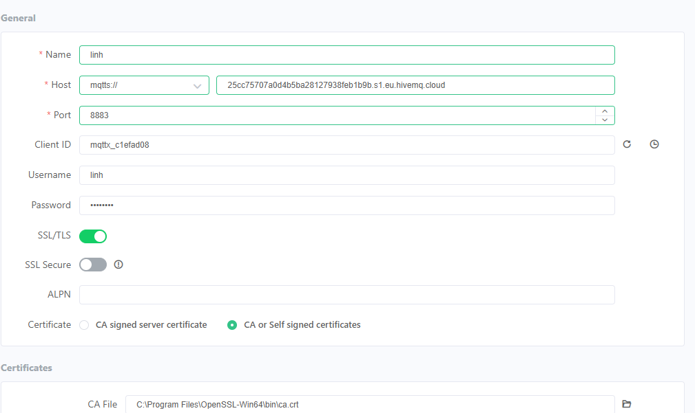
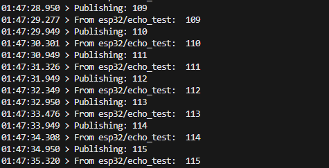
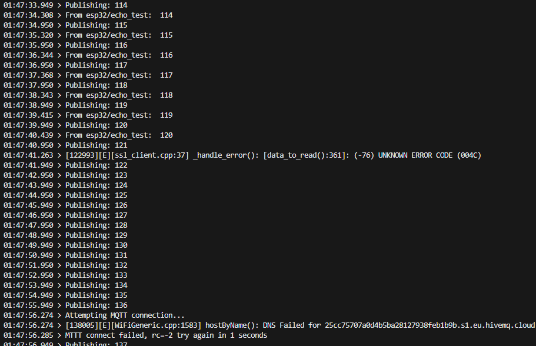
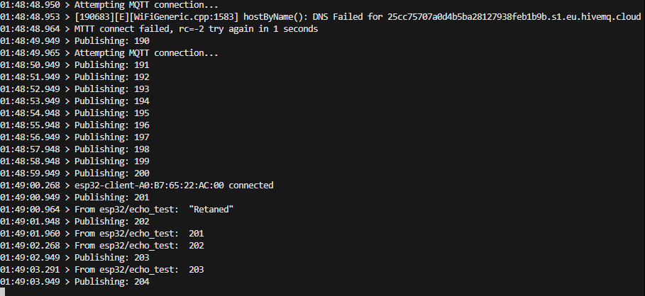
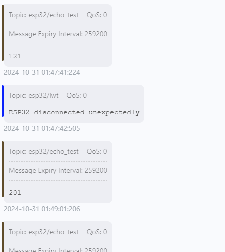

## Bố trí thí nghiệm 
- Sử dung MQTT client tạo 1 client kết nối đến broker hivemq đã tạo

- Dùng thư viện PubSubClient trên ESP32 kết nối với MQTT Broker đã tạo trên hivvemq .
- Sử dụng thư viện Ticker, một thư viện chuẩn trong Arduino để gọi hàm publish một cách đều đặn và bất đồng bộ, mỗi giây (1s) một lần:
    + Mã: `mqttPulishTicker.attach(1, mqttPublish)`
    + Tài liệu về Ticker: https://docs.arduino.cc/libraries/ticker/, https://github.com/espressif/arduino-esp32/blob/master/libraries/Ticker/src/Ticker.h 
- Subscribe tới topic `esp32/echo_test` ngay sau khi MQTT connect thành công
- Gọi hàm `mqttClient.loop()` trong main loop để handle các thông điệp nhận được từ broker (bất đồng bộ, event driven) bất kỳ lúc nào. 
- Phát hiện mất kết nối MQTT `if (!mqttClient.connected())` trong main loop để kết nối lại `mqttReconnect()` ngay khi phát hiện mất kết nối.

## Kịch bản thí nghiệm

- Sau khi ESP32 khởi động, sẽ kết nối WiFi vào một điểm phát AP đã định (ssid, và pass trong secrets/wifi.h) --> thành công
- Sẽ thấy MQTT Client kết nối đến broker thành công và bắt đầu gửi (publish) và nhận (subscribe) số đếm tăng dần trong `echo_topic` đều đặn

- Khi đó sẽ tiến hành ngắt điểm phát WiFi, tiện nhất là phát wifi từ điện thoại để bật ngắt nó nhanh chóng trong tầm tay
- Quan sát phản ứng của MQTT Client trong mã khi mất kết nối WiFi giữa chừng, 
- sau đó bật lại điểm phát WiFi và quan sát khả năng khôi phục kết nối, và quan sát việc mất gói tin trong quá trình kết nối.

## Mục đích 
- Xem việc ngắt kết nối từ bên dưới chồng Internet Protocol có ảnh hưởng tới lớp trên không. Ở đây là lớp WiFi (link layer) bị ngắt --> lớp TCP/IP bị ngắt --> có ảnh hưởng tới lớp ứng dụng MQTT trên cùng hay không? ESP core lib sẽ in ra thông điệp lỗi như nào (có báo lỗi từ lớp dưới lên lớp bên trên hay không?)
- Quan sát sự bỏ mặc việc mất thông điệp trong QoS = 0. 
- Hiểu rõ hơn về cơ chế hoạt động của MQTT client bên trên tầng TCP/IP, nhất là cơ chế phát hiện mất kết nối và khôi phục kết nối ở lớp vật lý, rất hay xảy ra trong thực tế.

## Kết quả
Quan sát thông điệp in ra theo thời gian ta thấy:

**Hình 1**

- **Hình 1** cho thấy: các tín hiệu in ra khi có wifi bình thường

**Hình 2**

2. Khi wifi bị ngắt kết nối cũng bị lỗi giống thí nghiệm trước:
- Xem **Hình 2**
- Sau khi mất kết nối thì phải 15 giây sau MQTT mới xác nhận là mất kết nối và cố gắng kết nối lại

**Hình 3**
4. Khi mở lại điểm phát WiFi (AP):
- **Hình 3** sau khi mở lại điểm phát wifi sẽ mất 9 giây để kết nối lại sever hivemq và bắt đầu gửi lại từ số 201

**Hình 4**
- Ở 1 subcriber đang lấy dữ liệu từ broker sẽ dừng lấy tín hiệu từ 121 và sau khi có lại dữ liệu subcriber sẽ nhận được 1 last will message là "ESP32 disconnected unexpectedly" sau đó tiếp tục nhận dữ liệu từ số 201.

## Side Note về việc sử dụng Wokwi simulator trên VS code

- Gần đây có thể cài đặt extension Wokwi trên VS code để mô phỏng phần cứng ESP32 cùng với kết nối WiFi từ chính máy tính người dùng. 
- ... hứa hẹn tăng tốc việc thử nghiệm các ý tưởng trên phần cứng ESP32 mà mất thời gian nạp code và bố trí phần cứng thực bên ngoài. 
- Link: https://docs.wokwi.com/vscode/getting-started/ 
- Tuy nhiên: ban đầu tôi chạy thí nghiệm này trên Wokwi và Không Thành Công, vì lý do Wokwi nó vẫn bắt phải có kết nối internet để quản lý giấy phép trả tiền của nó (khá thất vọng!) cho nên không thể dùng mô phỏng này để thử nghiệm việc mất kết nối vật lý. ("Wokwi required internet connection, ... please paid version!")
- Kết luận: Những thí nghiệm chuyên sâu về các kịch bản ngoài mong muốn (edge case) của phần cứng, vẫn phải dùng phần cứng thật. 

## Kết luận 

Việc "làm các thí nghiệm" trong công nghệ lập trình là vô cùng hữu ích ở nhiều phương diện:

- hiểu rõ hơn về tương tác của các thành phần trong mã
- hiểu rõ hơn về các trường hợp không được nói trong tài liệu nhưng có thể xảy ra trong thực tế (edge cases)
- giúp người lập trình hiểu rõ hơn về API của các thư viện mình sắp dùng 
- cũng là quá trình tiếp cận các thư viện và công nghệ mới hiệu quả vì nó cần phải động não mà cũng khá đơn giản.

## Gợi ý các ý tưởng thí nghiệm cho người học 

- Các bạn nên lặp lại thí nghiệm này trên một MQTT broker khác ngoài EMQX, ví dụ thiết lập tài khoản HiveMQ và đặt các thông số kết nối trong mã như ca_cert và username và password của chính bạn. Đây là một thực tập cần thiết để biết cách thiết lập một MQTT Broker sử dụng dịch vụ online. Các bạn hoàn toàn có thể sử dụng tài nguyên miễn phí mà hiveMQ cung cấp. 
- Tự cài đặt `https://mosquitto.org/` broker trên máy cá nhân để thực tập việc cài đặt một MQTT broker trên server riêng sau này mà không phụ thuộc vào dịch vụ của bên thứ 3. Sau đó lặp lại thí nghiệm này. Việc này là vô cùng hữu ích cho công việc tương lai. Các bạn có thể phải đọc tài liệu để biết phải thiết lập kết nối không mã hóa (cổng 1883) và kết nối TLS bằng việc tự phát ra chứng chỉ cho máy chủ của mình như thế nào.
- Các bạn có thể thử thiết đặt một trong hai tham số `mqttClient.setKeepAlive(keepAlive)`, `mqttClient.setSocketTimeout(socketTimeout)` như tôi đã comment trong mã để thấy rằng thời gian phát hiện ra việc mất kết nối của mqtt client có thể giảm xuống thấp hơn giá trị mặc định là 15s như quan sát bên trên, thông qua 1 trong hai thông số này. 