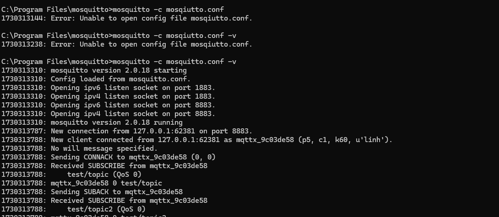
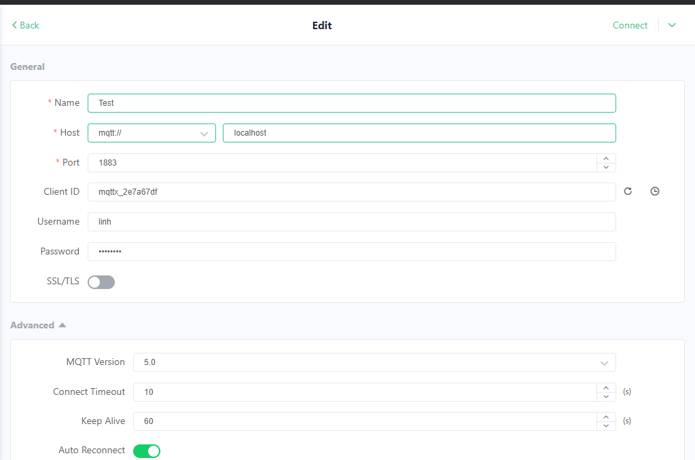
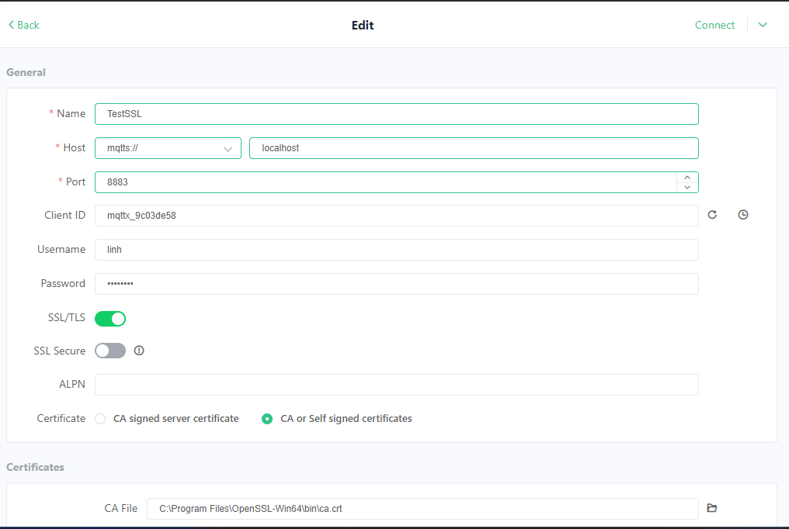
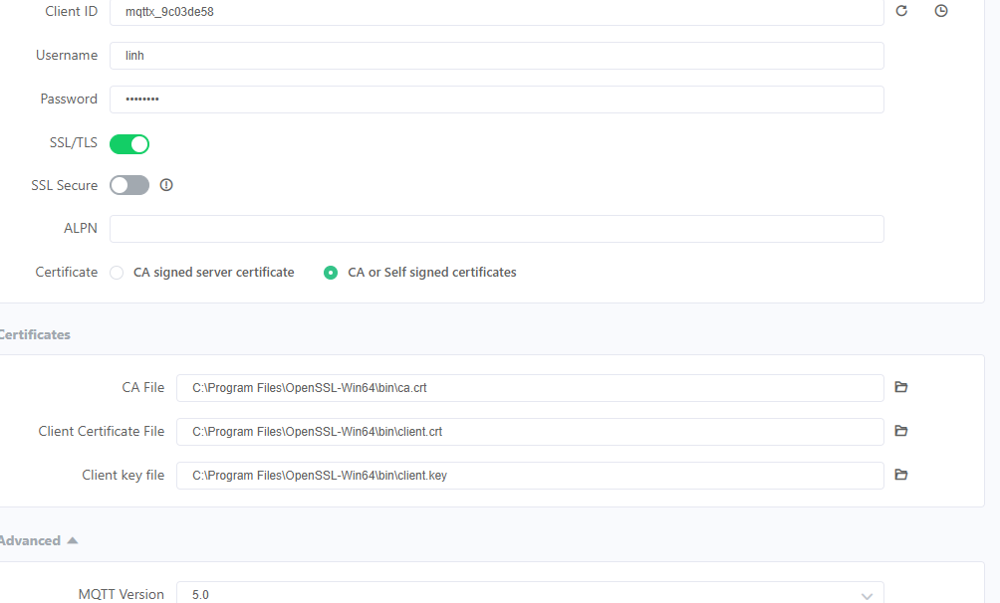
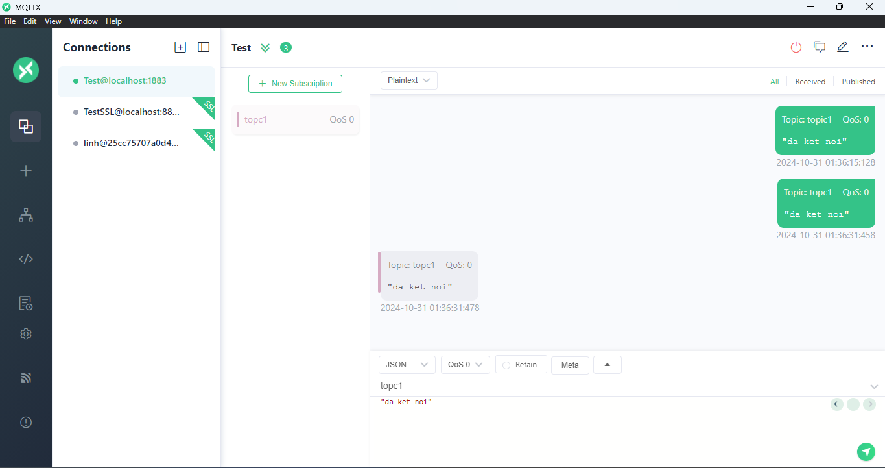
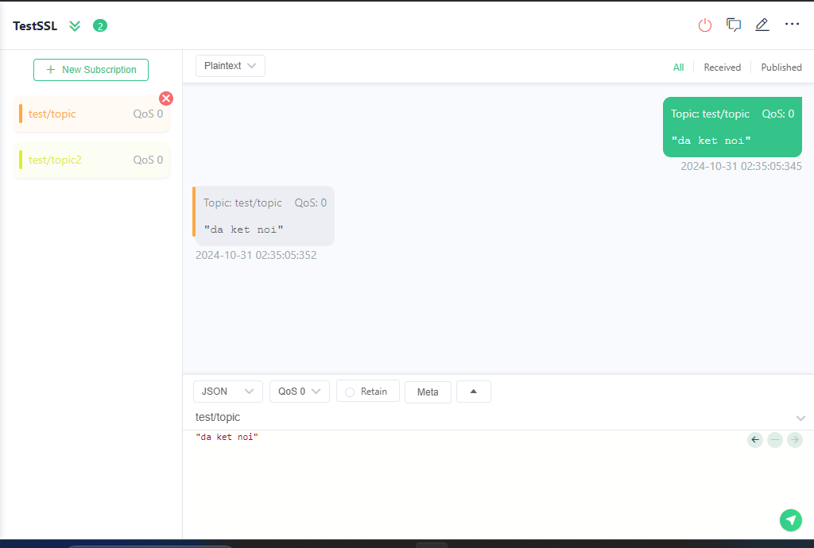

## Bố trí thí nghiệm 
- sử dụng mosquito tạo 1 broker trên máy cá nhân (PC)

- Sử dung MQTT client tạo 1 client kết nối đến broker mosquito đã tạo ở cổng 1883

- tạo chứng chỉ và khóa cho bảo mật TLS bằng openssl

- Sử dụng MQTT client tạo 1 client kết nối đến broker mosquito đã tạo ở cổng 8883 với các chứng chỉ đã tạo

## Kịch bản thí nghiệm

-Sau khi kết nối gửi 1 vài tin nhắn đến các topic trên các cổng bảo mật kiểm tra xem có nhận được không

## Kết quả

**Hình 3**

- **Hình 3** cho thấy: các tin nhắn được gửi và nhận ở cổng 1883 bình thường

**Hình 4**

- **Hình 4** cho thấy: các tin nhắn được gửi và nhận ở cổng 8883 bình thường

## Side Note về việc sử dụng Wokwi simulator trên VS code

- Gần đây có thể cài đặt extension Wokwi trên VS code để mô phỏng phần cứng ESP32 cùng với kết nối WiFi từ chính máy tính người dùng. 
- ... hứa hẹn tăng tốc việc thử nghiệm các ý tưởng trên phần cứng ESP32 mà mất thời gian nạp code và bố trí phần cứng thực bên ngoài. 
- Link: https://docs.wokwi.com/vscode/getting-started/ 
- Tuy nhiên: ban đầu tôi chạy thí nghiệm này trên Wokwi và Không Thành Công, vì lý do Wokwi nó vẫn bắt phải có kết nối internet để quản lý giấy phép trả tiền của nó (khá thất vọng!) cho nên không thể dùng mô phỏng này để thử nghiệm việc mất kết nối vật lý. ("Wokwi required internet connection, ... please paid version!")
- Kết luận: Những thí nghiệm chuyên sâu về các kịch bản ngoài mong muốn (edge case) của phần cứng, vẫn phải dùng phần cứng thật. 

## Kết luận 

Việc "làm các thí nghiệm" trong công nghệ lập trình là vô cùng hữu ích ở nhiều phương diện:

- hiểu rõ hơn về tương tác của các thành phần trong mã
- hiểu rõ hơn về các trường hợp không được nói trong tài liệu nhưng có thể xảy ra trong thực tế (edge cases)
- giúp người lập trình hiểu rõ hơn về API của các thư viện mình sắp dùng 
- cũng là quá trình tiếp cận các thư viện và công nghệ mới hiệu quả vì nó cần phải động não mà cũng khá đơn giản.

## Gợi ý các ý tưởng thí nghiệm cho người học 

- Các bạn nên lặp lại thí nghiệm này trên một MQTT broker khác ngoài EMQX, ví dụ thiết lập tài khoản HiveMQ và đặt các thông số kết nối trong mã như ca_cert và username và password của chính bạn. Đây là một thực tập cần thiết để biết cách thiết lập một MQTT Broker sử dụng dịch vụ online. Các bạn hoàn toàn có thể sử dụng tài nguyên miễn phí mà hiveMQ cung cấp. 
- Tự cài đặt `https://mosquitto.org/` broker trên máy cá nhân để thực tập việc cài đặt một MQTT broker trên server riêng sau này mà không phụ thuộc vào dịch vụ của bên thứ 3. Sau đó lặp lại thí nghiệm này. Việc này là vô cùng hữu ích cho công việc tương lai. Các bạn có thể phải đọc tài liệu để biết phải thiết lập kết nối không mã hóa (cổng 1883) và kết nối TLS bằng việc tự phát ra chứng chỉ cho máy chủ của mình như thế nào.
- Các bạn có thể thử thiết đặt một trong hai tham số `mqttClient.setKeepAlive(keepAlive)`, `mqttClient.setSocketTimeout(socketTimeout)` như tôi đã comment trong mã để thấy rằng thời gian phát hiện ra việc mất kết nối của mqtt client có thể giảm xuống thấp hơn giá trị mặc định là 15s như quan sát bên trên, thông qua 1 trong hai thông số này. 
